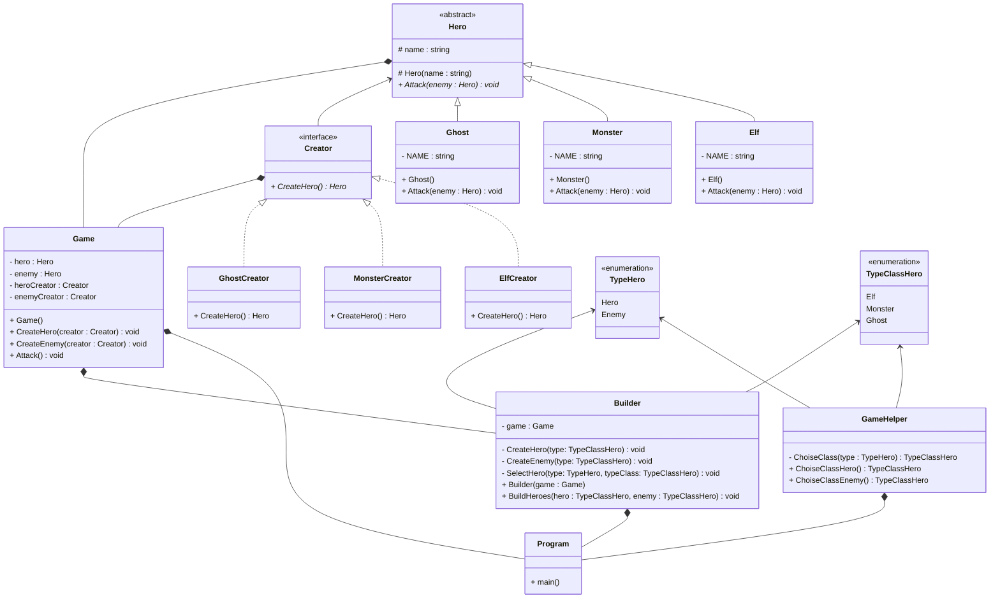

# Фабричный метод и Строитель

Реализация паттернов фабричный метод и строитель на `C++`

```mermaid
classDiagram

Game *-- Program
Builder *-- Program
GameHelper *-- Program
class Program {
    + main()
}
        
class Hero {
    <<abstract>>
    # name : string
    # Hero(name : string)
    + Attack(enemy : Hero)* void
}

Hero <|-- Elf
class Elf {
    - NAME : string
    + Elf()
    + Attack(enemy : Hero) void
}

Hero <|-- Monster
class Monster {
    - NAME : string
    + Monster()
    + Attack(enemy : Hero) void
}

Hero <|-- Ghost
class Ghost {
    - NAME : string
    + Ghost()
    + Attack(enemy : Hero) void
}

Hero <-- Creator
class Creator {
    <<interface>>
    + CreateHero()* Hero
}

Creator <|.. ElfCreator
class ElfCreator {
    + CreateHero() Hero
}

Creator <|.. MonsterCreator
class MonsterCreator {
    + CreateHero() Hero
}

Creator <|.. GhostCreator
class GhostCreator {
    + CreateHero() Hero
}

Hero *-- Game
Creator *-- Game
class Game {
    - hero : Hero
    - enemy : Hero
    - heroCreator : Creator
    - enemyCreator : Creator
    + Game()
    + CreateHero(creator : Creator) void
    + CreateEnemy(creator : Creator) void
    + Attack() void
}

class TypeHero {
    <<enumeration>>
    Hero
    Enemy
}

class TypeClassHero {
    <<enumeration>>
    Elf
    Monster
    Ghost
}

TypeHero <-- GameHelper
TypeClassHero <-- GameHelper
class GameHelper {
    - ChoiseClass(type : TypeHero) TypeClassHero
    + ChoiseClassHero() TypeClassHero
    + ChoiseClassEnemy() TypeClassHero
}

TypeHero <-- Builder
TypeClassHero <-- Builder
Game *-- Builder
class Builder {
    - game : Game
    - CreateHero(type: TypeClassHero) void
    - CreateEnemy(type: TypeClassHero) void
    - SelectHero(type: TypeHero, typeClass: TypeClassHero) void
    + Builder(game : Game)
    + BuildHeroes(hero : TypeClassHero, enemy : TypeClassHero) void
}
```
