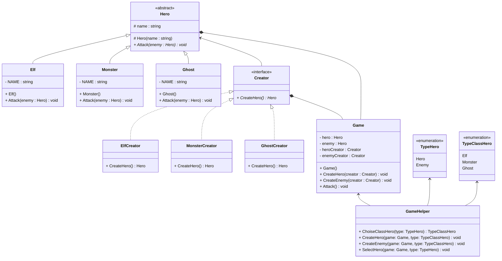

# Фабричный метод

## Factory Method, Фабричный метод

Реализация паттерна фабричный метод на `C++`

```mermaid
classDiagram

class Hero {
    <<abstract>>
    # name : string
    # Hero(name : string)
    + Attack(enemy : Hero)* void
}

Hero <|-- Elf
class Elf {
    - NAME : string
    + Elf()
    + Attack(enemy : Hero) void
}

Hero <|-- Monster
class Monster {
    - NAME : string
    + Monster()
    + Attack(enemy : Hero) void
}

Hero <|-- Ghost
class Ghost {
    - NAME : string
    + Ghost()
    + Attack(enemy : Hero) void
}

Hero <-- Creator
class Creator {
    <<interface>>
    + CreateHero()* Hero
}

Creator <|.. ElfCreator
class ElfCreator {
    + CreateHero() Hero
}

Creator <|.. MonsterCreator
class MonsterCreator {
    + CreateHero() Hero
}

Creator <|.. GhostCreator
class GhostCreator {
    + CreateHero() Hero
}

Hero *-- Game
Creator *-- Game
class Game {
    - hero : Hero
    - enemy : Hero
    - heroCreator : Creator
    - enemyCreator : Creator
    + Game()
    + CreateHero(creator : Creator) void
    + CreateEnemy(creator : Creator) void
    + Attack() void
}

class TypeHero {
    <<enumeration>>
    Hero
    Enemy
}

class TypeClassHero {
    <<enumeration>>
    Elf
    Monster
    Ghost
}

TypeHero <-- GameHelper
TypeClassHero <-- GameHelper
Game <-- GameHelper
class GameHelper {
    + ChoiseClassHero(type: TypeHero) TypeClassHero
    + CreateHero(game: Game, type: TypeClassHero) void
    + CreateEnemy(game: Game, type: TypeClassHero) void
    + SelectHero(game: Game, type: TypeHero) void
}

```